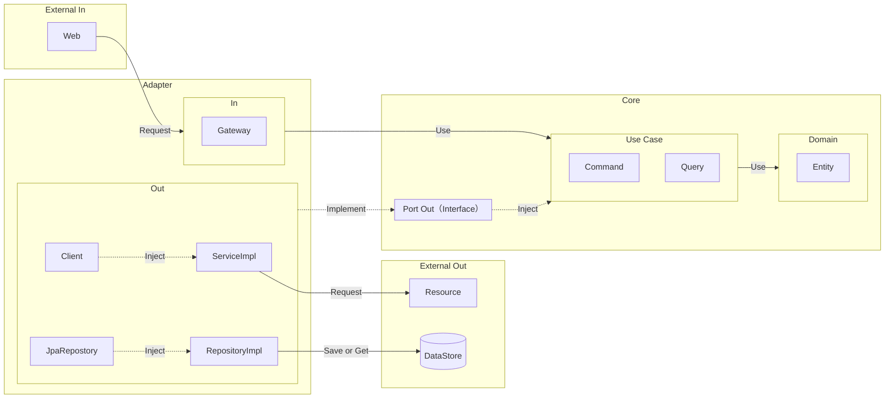

# Architecture
### References
1. Clean Architecture
2. Hexagonal Architecture
   
### Diagram

```mermaid
graph LR
		
	subgraph External Out
		resource[Resource]
		data-store[(DataStore)]
	end
		
	subgraph External In
		web[Web]
	end
	
	subgraph adapter[Adapter]
		subgraph adapter-in[In]
			adapter-in-Gateway[Gateway]
		end
		subgraph adapter-out[Out]
			adapter-out-service-impl[ServiceImpl]
			adapter-out-repo-impl[RepositoryImpl]
			adapter-out-client[Client]
			adapter-out-jpa-repostory[JpaRepostory]
		end
	end
	
	subgraph core[Core]
		subgraph domain[Domain]
			Entity
		end
		subgraph use-case[Use Case]
			Command
			Query
		end
		subgraph core-port-out[Port Out（Interface）]
		end
	end
	
	web -- Request --> adapter-in
	
	adapter-in -- Use --> use-case
	use-case -- Use --> domain
	adapter-out-client -. Inject .-> adapter-out-service-impl
	adapter-out-jpa-repostory -. Inject .-> adapter-out-repo-impl
	adapter-out -. Implement .-> core-port-out
	core-port-out -. Inject .-> use-case
	
	adapter-out-repo-impl -- Save or Get --> data-store
	adapter-out-service-impl -- Request --> resource
```
