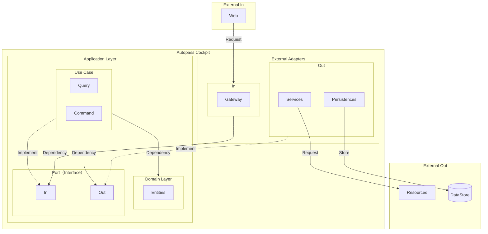

# Reference
1. Clean Architecture
2. Hexagonal Architecture

# Architecture Diagram

```mermaid
  graph TB
  	subgraph Autopass Cockpit
  		subgraph application-layer[Application Layer]
  			subgraph domain-layer[Domain Layer]
  				Entities
  			end
  			subgraph use-case[Use Case]
  				query[Query]
  				command[Command]
  			end
  			subgraph port[Port（Interface）]
  				application-layer-port-in[In]
  				application-layer-port-out[Out]
  			end
  		end
  		
  		subgraph external-adapters[External Adapters]
  			subgraph external-adapters-in[In]
  				external-adapters-in-Gateway[Gateway]
  			end
  			subgraph external-adapters-out[Out]
  				Services
  				Persistences
  			end
  		end
  	end
  		
  	subgraph External Out
  		resources[Resources]
  		data-store[(DataStore)]
  	end
  		
  	subgraph External In
  		web[Web]
  	end
  	
  	use-case -- Dependency --> domain-layer
  	use-case -. Implement .-> application-layer-port-in
  	use-case -- Dependency --> application-layer-port-out
  	external-adapters-in -- Dependency --> application-layer-port-in
  	external-adapters-out -. Implement .-> application-layer-port-out
  	
  	web -- Request --> external-adapters-in
  	Persistences -- Store --> data-store
  	Services -- Request --> resources
```
