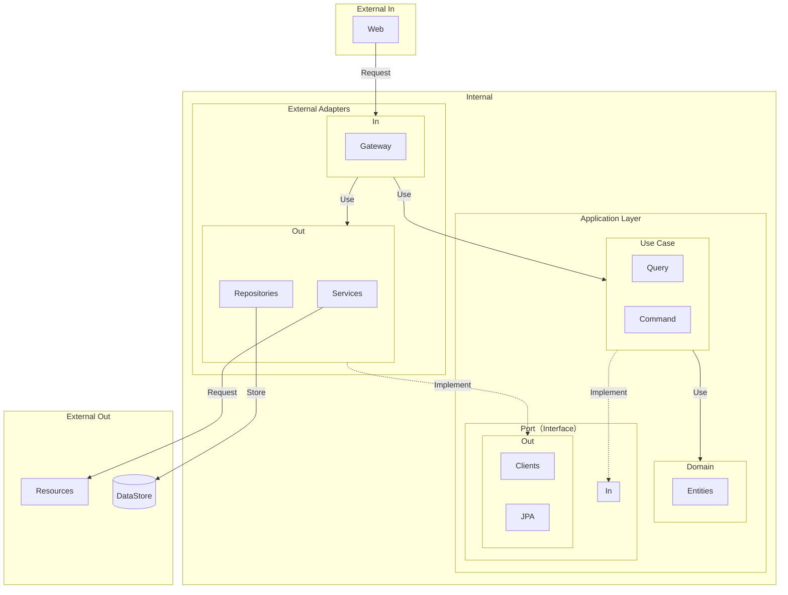

# Architecture
### Based on
1. Clean Architecture
2. Hexagonal Architecture
   
### Diagram

```mermaid
graph TB
	subgraph Internal
		subgraph application-layer[Application Layer]
			subgraph domain[Domain]
				Entities
			end
			subgraph use-case[Use Case]
				query[Query]
				command[Command]
			end
			subgraph port[Port（Interface）]
				subgraph application-layer-port-in[In]
				end
				subgraph application-layer-port-out[Out]
					Clients
					JPA
				end
			end
		end
		
		subgraph external-adapters[External Adapters]
			subgraph external-adapters-in[In]
				external-adapters-in-Gateway[Gateway]
			end
			subgraph external-adapters-out[Out]
				Services
				Repositories
			end
		end
	end
		
	subgraph External Out
		resources[Resources]
		data-store[(DataStore)]
	end
		
	subgraph External In
		web[Web]
	end
	
	use-case -- Use --> domain
	use-case -. Implement .-> application-layer-port-in
	external-adapters-in -- Use --> external-adapters-out
	external-adapters-in -- Use --> use-case
	external-adapters-out -. Implement .-> application-layer-port-out
	
	web -- Request --> external-adapters-in
	Repositories -- Store --> data-store
	Services-- Request --> resources
```
